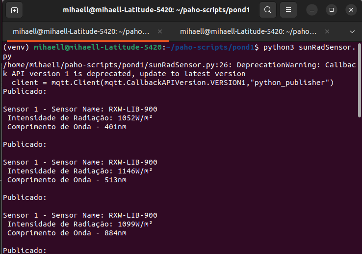
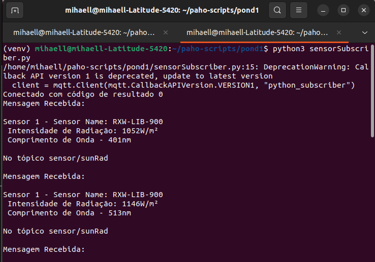
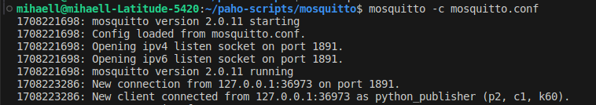

# Simulador de Dispositivos IoT - Ponderada 01 - M09

## Objetivo

Esse repositório tem como objetivo simular uma comunicação MQTT entre um sensor de Radiação Solar [RXW-LIB-900](https://sigmasensors.com.br/produtos/sensor-de-radiacao-solar-sem-fio-hobonet-rxw-lib-900), que por sua vez é derivado de uma classe genérica de Sensor, e um Subscriber local, mediado pelo [Broker Mosquitto](https://eclipse.dev/paho/index.php?page=clients/python/index.php). Para isso foi utilizado [Paho MQTT](https://eclipse.dev/paho/index.php?page=clients/python/index.php)

## Setup

Antes de executar o código, é necessário realizar algumas instalações. Siga as etapas abaixo:

Certifique-se de ter instalado a biblioteca 'paho-mqtt'

```bash
pip install 
```

E o Broker MQTT Mosquitto

```bash
sudo apt-get install mosquitto mosquitto-clients
```

Inicie o Broker com o arquivo de configuração localizado na pasta mosquito

```bash
mosquitto -c mosquitto.conf
```

## Executando

No terminal dentro do diretório, com o Broker rodando, execute os seguintes comandos:

```bash
python3 sunRadSensor.py
```
```bash
python3 sensorSubscriber.py
```

## Resultados esperados

Sensor publicando mensagens:


Subscriber recebendo mensagens:


Boker após executar ambos Scripts


# Video da execução

[Video Executando o projeto](https://youtu.be/uBxdXjn5uDY)
